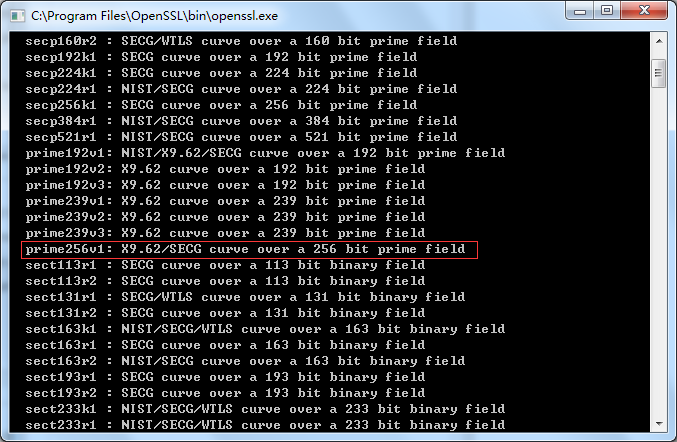
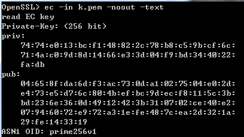
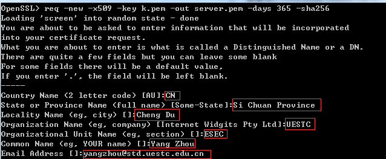
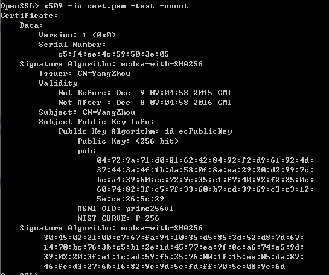
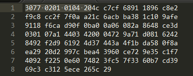
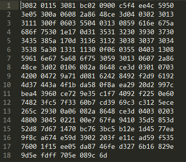

*本文档使用openssl 1.0.2e*
首先，打开openssl，使用命令：
>ecparam -list_curves

查看openssl所支持的椭圆曲线算法：  
  
u2f规范中对签名算法的要求是ECDSA signature(on P-256)，其实就是NIST所规定的secp256r1(注意不是secp256k1)。在openssl中是定义的prime256v1。  
然后输入：
>ecparam -name secp256r1 -genkey -out key.pem

就会生成公私钥文件key.pem。可以通过以下命令查看：  
>ec -in key.pem -noout -text

  
私钥32字节，公钥65字节（https://www.ietf.org/rfc/rfc5480.txt，根据这个文献，公钥第一字节0x04表示uncompressed，如果是0x02 or 0x03则表示compressed，u2f要求是uncompressed）

然后就可以开始生成自签名证书：  
>req -new -x509 -key key.pem -out cert.pem -days 365 -sha256

~~**注意，u2f对证书签名时所作hash算法没要求，但是最好是sha256，但是这里命令里的-sha256并没有作用，因为此版本openssl(0.9.8l)还不支持sha256**~~  
**openssl 1.0.2e支持sha256摘要**

然后会要求输入一堆信息，之后就会生成证书cert.pem：
  
查看证书命令：
>x509 -in cert.pem -text -noout

  
可以注意到其中签名算法是ecdsa-with-sha256。**还要注意这里版本号是v1，如果要用v3的话，则在生成证书的命令里还要加上 -extensions v3_ca，但是这样就会有一部分证书扩展**

**现在问题是，这些证书都是DER编码的。。。怎么转成二进制编码。。。**
----
上面这些命令生成的文件其实都是pem(Privacy Enhanced Mail)格式的。  

**PEM** - Privacy Enhanced Mail,打开看文本格式,以"-----BEGIN..."开头, "-----END..."结尾,内容是BASE64编码.  
查看PEM格式证书的信息:openssl x509 -in certificate.pem -text -noout  
Apache和*NIX服务器偏向于使用这种编码格式.  
**DER** - Distinguished Encoding Rules,打开看是二进制格式,不可读.  
查看DER格式证书的信息:openssl x509 -in certificate.der -inform der -text -noout  

####证书编码的转换
**PEM转为DER** openssl x509 -in cert.pem -outform der -out cert.der  

**DER转为PEM** openssl x509 -in cert.der -inform der -outform pem -out cert.pem

下面将key.pem：  
  
使用命令：
>ec -in key.pem -outform der -out key.der

之后用sublime打开key.der查看：  
  
可以看见30 77 02 01 01 04 20之后是私钥，这个前缀不知道是什么意思。  
~~这个二进制文件相当长，因为它是带了证书扩展的。要去掉证书扩展，可以编辑openssl.cfg文件中，找到：~~
~~>x509_extensions	= v3_ca	# The extentions to add to the self signed cert~~

~~将其注释掉，之后再生成证书~~
~~可以发现已经不带扩展。（版本为什么变成了V1？）~~  
~~此时再转成DER文件，会发现二进制码少了很多。~~

将证书使用命令：  
>x509 -in cert.pem -outform der -out cert.der

得到：  
  
一共281字节
>**下面来解析下这个证书(依据《PKI技术》 4.4 证书编码，是基于DER编码的)**
>1： "30"表示证书整体上是一个SEQUENCE
>2： "82"表示这个SEQUENCE的长度用"长形式"编码，且表示长度的字节码的长度为2字节
>3-4： "01 15"表示SEQUENCE的长度为0x0115=279字节，其后就是SEQUENCE的Value部分，也就是证书的各个部分
>5-7： "30 81 bc"表示其后的188字节应解码为一个SEQUENCE。
>8-9： "02 09"表示其后是9字节的整数
>10-18: "00 c5 f4 ee 4c 59 50 3e 05"表示serial number(**本来第一个应该是version，但是x509默认是v1，因此这里没有version号。如果是v3则会有。**)
>19-20： "30 0a"，这是个SEQUENCE,有10字节
>21-30："06082a8648ce3d040302"，这是个TLV，06表示OBJECT IDENTIFIER，08表示有8字节，根据证书格式，这个表示AlgorithmIdentifier，也就是ecdsa-with-SHA256的OID（见https://tools.ietf.org/html/rfc5758，3.2节）：1.2.840.10045.4.3.2。
>31-32： "30 13"，这是个SEQUENCE，有19字节
>33-34： "31 11"，这是个SET，有17字节
>35-36： "30 0f"
>37-43: "0603 5504 0313 08",不会解析了，反正就是issuer那部分。最后08表示issuer有8字节。
>44-51："59 616e 675a 686f 75"，YangZhou
>"30 1e17 0d31 3531 3230 3930 3730
3435 385a 170d 3136 3132 3038 3037 3034
3538 5a": validity字段
>"30 1331 1130 0f06 0355 0403 1308
5961 6e67 5a68 6f75": subject字段
>"3059 3013 0607 2a86
48ce 3d02 0106 082a 8648 ce3d 0301 0703
4200": subjectPublicKeyInfo字段
>公钥："0472 9a71 d081 6242 8492 f2d9 6192
4d37 443a 4f1b da58 0f8a ea29 20d2 997c
bea4 3960 ce72 9e35 c1f7 4092 f225 0e60
7482 3fc5 7f33 60b7 cd39 69c3 c312 5ece
265c 29"
>最后71字节是签名。（官方给的例子是70字节，我在网上自己签名是72字节，都不一样长，这是因为ecdsa算法的特性决定的）

好复杂，后面就不解析了。。。