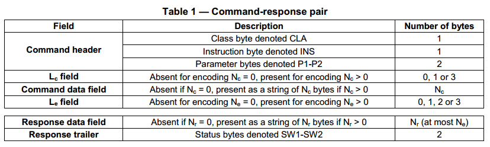
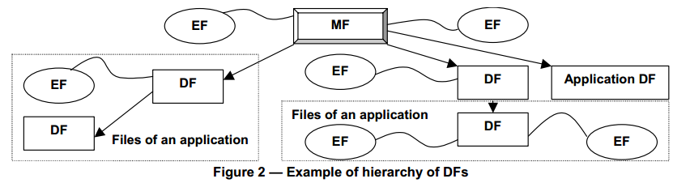
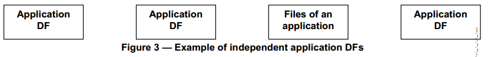
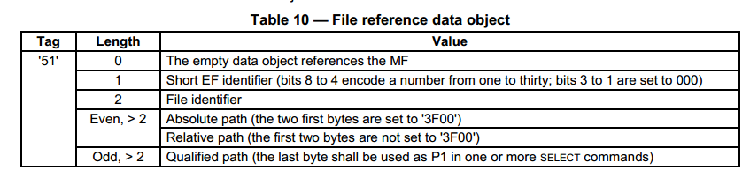

### 1.APDU
C-APDU就是Command APDU?
  
是否支持扩展APDU，是在histrotical bytes或EF.ATR中申明的。  

### 5.2 Data Objects
本文档定义了两个：SIMPLE-TLV和BER-TLV（但是X509证书一般是DER格式的？） 
#### 5.2.1 SIMPLE-TLV
SIMPLE-TLV由2或3部分组成：TAG，LEN，VALUE(可能有)。一个record可能是SIMPLE-TLV编码的。
* TAG:只有一个byte，范围1-254。00和FF是不合法的。如果record是用SIMPLE-TLV编码，那么TAG字段是record identifier。
* LENGTH：由1-3个byte编码。如果第一个byte不是FF，那么LENGTH就只有一个字段，范围0-254；如果第一个byte是FF，那么后两字节是LENGTH，范围0-65535。

#### 5.2.2 BER-TLV
* TAG：由1-3个字节组成。00不合法。
* LENGTH：由一个或多个字节组成。

### 5.3 Structures for applications and data
有两种文件结构，一种是树形的（有MF），一种是并列的
树形：  
  
并列：  
  
有四种显示选择的方法：    
* Selection by DF name：一个DF name可以表示任意一个DF，最多16字节。application identifier（AID）就是一个DF name。
* Selection by file identifier：一个file identifier可以表示任意file（包括DF，EF）。只有2字节。3F00表示MF。FFFF, 3FFF, 0000不可用。在一个给定的DF下，file identifier必须唯一。
* Selection by path：一个path可以表示任意file。它是file identifier的连接。
* Selection by short EF identifier：short EF identifier可以表示任意EF。由5 bits组成，00000表示当前EF。short EF identifier不能用于path中，或者用于EF identifier(比如在一个SELECT COMMAND中)

#### 5.3.1.2 File reference data element
  
