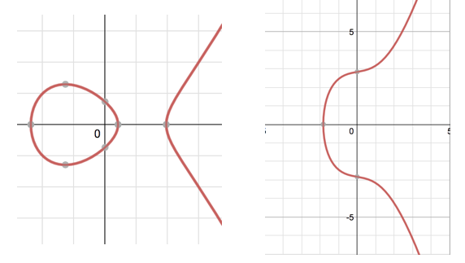

###ECC的优势
说 ECC 的优势前，先列举几个 RSA 的劣势：
1. 破解越来越容易。RSA 加密的原理是基于大数运算（2的几千次幂的规模），随着计算机的运算速度越来越快，破解 RSA 的难度逐步降低。目前 1024 位 RSA 密钥已经被认为是不安全的。生产环境使用的 RSA 密钥要求至少是 2048 位。
2. 加密速度比较慢。大数运算很耗计算资源，速度很慢，不适合在嵌入式设备中使用。

ECC 完美解决了以上问题：
1. ECC 基于非常复杂的椭圆曲线算法，数学上被证明是不可破解的——意思就是，即使计算机速度再快，也不可能破解 ECC。
2. 加密速度快。相同密钥强度下，ECC 的加密速度大约是 RSA 的 10 倍，适合在 Secure Element、TrustZone 等一些计算资源比较紧张的环境中使用。

###ECC的公钥和私钥
ECC 的原理非常复杂，所谓的“椭圆”，并不单指我们通常意义上的椭圆，像下面这样的曲线都属于符合 ECC 定义的“椭圆”。  
  
ECC 加解密的原理是在二维平面上找点。要利用 ECC 做加解密，需要：  
1. 确定一个椭圆方程  
并不是所有的椭圆都可以用来加密，诸如 y^2=x^3+a*x+b 这样的椭圆是一类可以用来加密的椭圆。
2. 在这个椭圆上找一个点  
用 G 表示。
3. 确定用于找点的平面范围  
用 p 或 m 指定。

因此，描述一个 ECC 算法，一般用到 6 个常量：p,a,b,G,n,h 或 m,a,b,G,n,h 。如果加入随机因子，再加 1 个常量：S 。 上面这些常量的取值可能有无数种。为了使用方便，SECP 和 IETF 定义了一些组合，并为每种组合取了个名字，如 secp256r1、brainpoolP256r1 等。根据这些曲线名字，我们可以确定 ECC 算法所需要的常量值。其中，G 代表的是二维坐标上的一点，数值上用 x,y 表示。

----
在java card中：<http://www.win.tue.nl/pinpasjc/docs/apis/jc222/javacard/security/ECKey.html>  
